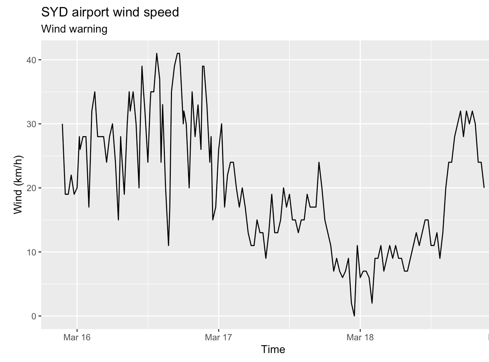

```{r, echo = FALSE}
knitr::knit_hooks$set(error = function(x, options) {
  paste0("<pre style=\"color: red;\"><code>", x, "</code></pre>")
})

knitr::opts_chunk$set(echo = TRUE, fig.retina = 2)

suppressPackageStartupMessages({
  library(bomrang)
  library(tidyverse)
})
```


# Instructions 

+ All materials are in this repo: https://github.com/kevinwang09/shiny_3888
+ Try to download a copy of the repository via (https://github.com/kevinwang09/shiny_3888/archive/master.zip) if they want to run the materials interactively in class. 
+ Slides are here: https://kevinwang09.github.io/shiny_3888
+ Install revevant packages here: https://github.com/kevinwang09/shiny_3888/blob/master/install.R

---

# Lecture outline

+ Case scenario: Sydney airport dashboard in a Rmd file
+ Inputs and outputs of a Shiny app
+ Demo 1: `bomrang` Shiny app - wind plot
+ Demo 2: `bomrang` Shiny app - temperature plot and `reactive`
+ Demo 3: `bomrang` Shiny app - deployment
+ COVID-19 Shiny app competition 
+ Tips and resources for Shiny
---

class: segue
 
Motivation: weather warning
---
# Case study: issuing wind warnings 

+ Imagine that you are working at Sydney airport as a data scientist

+ You are responsible for issuing wind speed warnings whenever the windspeed reaches 30km/h (or above) in the past 72 hours

<center>

</center>
---


# `bomrang.Rmd`

[Vignette of bomrang](https://cran.r-project.org/web/packages/bomrang/vignettes/bomrang.html)

.scroll-output[
```{r, fig.width = 14, fig.height = 5, warning=FALSE}
library(bomrang)
library(tidyverse)

location = "Sydney airport"
weather = bomrang::get_current_weather(location)

glimpse(weather)

weather %>% 
  ggplot(aes(x = local_date_time_full,
             y = wind_spd_kmh)) +
  geom_path() +
  labs(x = "Time", 
       y = "Wind (km/h)")
```
]

---

# Communicating results using a `Rmd` file

+ A Rmd file captures a snapshot of the data with a fixed set of parameters

  - Good for reproducibility and record keeping
  - Bad for looking at updated data (e.g. "Sydney airport" is hard-coded)

--

+ A Shiny app can access data in real-time and modify outputs (plots & summary statistics) instantly based on user inputs (parameters like "location")

+ A Shiny app is a dashboard application*. It hides all the computations in the background and only shows inputs and outputs more relevant to the user (a domain expert not familiar with the underlying R codes)

.footnote[If you want to see examples of dashboards: https://ourworldindata.org/coronavirus]
--

+ The purpose of this lecture is to build this simple Shiny app and understand its design:

```
shiny::runGitHub(
    repo = "shiny_3888", 
    username = "kevinwang09", 
    subdir = "bomrang_3888")
```

---

# Why Shiny feels a bit funny?

+ A Shiny app is very much point-and-click 

+ But underneath, Shiny uses R for computation and impose very strict rules on input and output 
+ So much so it almost feels like Shiny is a language on its own

+ For the bomrang Shiny app, try to focus on three components:

    1. Input (enter location)
    1. Computation (download data, make plots, modelling)
    1. Outputs (show figures, make interpretations)

---
class: segue

Demo 0: Knitting `bomrang.Rmd` will give you a skeleton Shiny app

(This is not a full app, but only to see what an "input" and an "output" are in context of a Shiny app) 
---
# `input` and `output`: the core of Shiny

Input: a location as text
```{r, eval = FALSE}
* textInput(inputId = "location",
            label = "Put a location here!",
            value = "Sydney airport")
```

Output: make a ggplot
```{r, eval = FALSE}
renderPlot({
* weather = get_current_weather(input$location)

  weather %>% 
    ggplot(aes(x = local_date_time_full,
               y = wind_spd_kmh)) +
    geom_path() +
    labs(x = "Time", 
         y = "Wind (km/h)")
})
```
---

class: segue

shiny = `ui.R`+ `server.R`

---
# A Shiny app is made up of two `.R` scripts*

+ Inputs
    - Special function managing inputs in `ui.R`
+ Analysis
    - Write normal `R` codes in `server.R`
+ Outputs
    - Special function managing outputs in `ui.R`
    
.footnote[*you are allowed to have more than two scripts, if you wish to better organise substaintial codes (e.g. using `global.R`, see later)]
---
class: segue

Demo 1: Let's build your first Shiny app!
---

# `ui.R`

```{r, eval = FALSE}
library(shiny)
library(bomrang)
library(tidyverse)

*shinyUI(
*    fluidPage(
        textInput(inputId = "location",
                  label = "Put a location here!",
                  value = "Sydney airport"),
        plotOutput(outputId = "wind_plot")
*    )
*)
```

+ The inputs as determined from `ui.R` are passed to `server.R` as a list, named `input`
+ You can access these inputs in `server.R` using `input$inputId`
+ `fluidPage` is not terribly important here

---

# `server.R`

+ The outputs as processed by `server.R` are passed to `ui.R` as a list, named `output`
+ You can access these ouputs in `ui.R` using `output$outputId`

```{r, eval = FALSE}
* shinyServer(function(input, output) {
*    output$wind_plot = renderPlot({
      weather = get_current_weather(input$location)
        weather %>% 
          ggplot(aes(x = local_date_time_full,
                     y = wind_spd_kmh)) +
          geom_path() +
          labs(x = "Time", 
               y = "Wind (km/h)")
    })
})
```
---

# This is a good time to pause

+ **Users can interact instantly with the designed input/output. That is its biggest advantage over Rmd**.

+ My typicall workflow: 
  - Write a `Rmd` file before making a full app to ensure all codes are correct and get a sense of what should be inputs/outputs
  - Open up a an old Shiny app I made or, from RStudio (File -> New File -> Shiny Web App)

--

+ There are many more `render*` and `*Input` functions, see [here](https://kevinwang09.github.io/SSA-Shiny-Workshop-2019/01-Intro.html#20) for a incomplete list.

+ Designing a good UI is more of an art, I found looking at other people's work to be quite useful (see extra links at the end of these slides)
---

class: segue

Demo 2: `reactive`, a key concept in Shiny apps

---
# "reactive" values

+ `renderPlot` (and other types of `render*`) are called "reactive" functions. Meaning they will react to changes in the `input` list. 

+ Trying to make an output without a reactive function (i.e remove the `renderPlot` function) results in an error similar to this: 

```
Error in .getReactiveEnvironment()$currentContext() : 
  Operation not allowed without an active reactive context. 
  (You tried to do something that can only be done from inside a reactive expression or observer.)
```

---

# This `server.R` will fail. Why?

```{r, eval = FALSE}
shinyServer(function(input, output) {
    output$wind_plot = renderPlot({
       weather = get_current_weather(input$location)
       weather %>% 
          ggplot(aes(x = local_date_time_full,
                     y = wind_spd_kmh)) +
          geom_path() +
          labs(x = "Time", 
               y = "Wind (km/h)")
    })
    
*  output$temp_plot = renderPlot({
*         weather %>% 
*            ggplot(aes(x = local_date_time_full,
*                       y = apparent_t)) +
*            geom_path() +
*            labs(x = "Time", 
*                 y = "Apparent Temp (Celcius)")
*   })
})
```

---
# This `server.R` will fail. Why?

```{r, eval = FALSE}
shinyServer(function(input, output) {
    output$wind_plot = renderPlot({
*      weather = get_current_weather(input$location)
*      weather %>% 
          ggplot(aes(x = local_date_time_full,
                     y = wind_spd_kmh)) +
          geom_path() +
          labs(x = "Time", 
               y = "Wind (km/h)")
    })
    
  output$temp_plot = renderPlot({
*        weather %>% 
            ggplot(aes(x = local_date_time_full,
                       y = apparent_t)) +
            geom_path() +
            labs(x = "Time", 
                 y = "Apparent Temp (Celcius)")
   })
})
```


---
# This `server.R` will work, but why it is a bad idea?

```{r, eval = FALSE}
shinyServer(function(input, output) {
    output$wind_plot = renderPlot({
*      weather = get_current_weather(input$location)
        weather %>% 
            ggplot(aes(x = local_date_time_full,
                       y = wind_spd_kmh)) +
            geom_path() +
            labs(x = "Time", 
                 y = "Wind (km/h)")
    })
    
    output$temp_plot = renderPlot({
*      weather = get_current_weather(input$location)
        weather %>% 
            ggplot(aes(x = local_date_time_full,
                       y = apparent_t)) +
            geom_path() +
            labs(x = "Time", 
                 y = "Apparent Temp (Celcius)")
    })
})
```

---

# The `reactive()` function

+ Since the two plots has the same reactive component, i.e. fetching the data via the line
```
weather = get_current_weather(input$location)
```
we only need make a general function that will react to the location input and pass that onto the two `renderPlot` functions. 

+ This is where the `reactive()` function comes in!

---
# `reactive()` in action

```{r, eval = FALSE}
shinyServer(function(input, output) {
    
*    fetch_data = reactive({
*        weather = get_current_weather(input$location)
*        return(weather)
*    })
    
    output$wind_plot = renderPlot({
        fetch_data() %>% 
            ggplot() ## etc
    })
    
    output$temp_plot = renderPlot({
        fetch_data() %>% 
            ggplot() ## etc
    })
    
})
```
---
class: segue

Demo 3: more advanced reactive actions
---

# `actionButton` and `eventReactive`

+ When we type out the phrase "Sydney airport", you notice the plots change immediately. 
+ However, this actually isn't ideal: multiple fetches of the data will be executed as your type out the letters.

+ This could be a problem if the computation is really computationally intensive or makes too many API requests to an external server. 

+ You could use an `actionButton()` in the `ui.R`, which, upon clicking, changes the value of `input$button`.

+ `eventReactive` in `server.R` will be set up such that every change in the value of `input$button` will trigger the execution of some codes. 

---
# `actionButton` and `eventReactive`

+ `ui.R`

```{r, eval = FALSE}
shinyUI(fluidPage(
  ...
*    actionButton(inputId = "button", label = "Fetch data and plot")
  ...
))
```

+ `server.R`

```{r, eval = FALSE}
shinyServer(function(input, output) {
    
*  fetch_data = eventReactive(input$button, {
        weather = get_current_weather(input$location)
        return(weather)
    })
...
## renderPlot as before
})
```
---

# `observe()` changes the internal values objects (extension)

+ Unlike `reactive()`, the `observe()` will change the internal values of `R` objects.

+ Try adding this code to `server.R` and see what happens in the **console**. 

```{r, eval = FALSE}
obs = observe({
        print(
            paste0(input$location, " is fun!")
        )
    })
```

+ A special case of `observe()` is `observeEvent()`, see some uses in context of `actionButton()` [here](https://shiny.rstudio.com/articles/action-buttons.html). 

---

# `global.R` will always run when you launch a Shiny app


+ A good place to put in codes like:
```{r, eval = FALSE}
library(shiny)
library(bomrang)
library(tidyverse)
library(forecast)

theme_set(theme_bw(base_size = 18))

customised_function = function(...){
  ...
}
```

---
class: segue

Demo 4: deploying Shiny app

---

# Deploying your app

+ You can share your app via `shinyapps.io`.
  - Hosts up to 5 applications and 25 active hours per month.

+ Alternatively, you can put the Shiny scripts on GitHub. 
  - People need to run the app locally on their laptop with all necessary packages installed. 
```{r, eval = FALSE}
library(tidyverse)
library(shiny)
library(forecast)
library(ggrepel)
library(nCov2019)
## devtools::install_github("GuangchuangYu/nCov2019")

shiny::runGitHub(
    repo = "covid19", 
    username = "kevinwang09", 
    ref = "master")
```

---
class: segue

Demo 5: debugging Shiny app (extension)

---

# Empty string in the input text box

See https://shiny.rstudio.com/articles/debugging.html

+ Most common error: unexpect input. Put `validate()` and `need()` around the appropriate input
```
validate(
  need(input$location, 'Choose a location!'))
```
+ Set breakpoint 
+ `browser()`
+ `shiny::runApp(display.mode="showcase")`
+ `shiny::showReactLog()`
+ Print warning messages in console for diagnosis
+ `options(shiny.error = browser)`
---
# Summary

1. Shiny is a R framework to build dashboard applications 
2. Shiny places great emphasis on the inputs and outputs of an app and use R as the backend for computation
3. `reactive` is a general function that reacts to changes in `input`
4. `eventReactive` allows for a delayed action in the app (together with the use of `actionButton`)

---

# Do's and dont's

- Do's
  + Write a Rmd file to plan out what are the inputs/ouputs of an app
  + Build a working app first before prettifying
  + Google! There are a lot of free resources/blog posts and app examples on GitHub
  + Make lots of git commits (always have a working copy to go back to)

- Dont's
  + Write awfully long functions, try to modularise your code whereever possible (this is why I don't use `app.R`)
  + Manage your brackets by using comments and chunk collapse
  + Cry when debugging Shiny
  + Make an app that takes up a lot of resources
---

# Talking through some apps

+ [COVID19](https://github.com/kevinwang09/covid19):
    - `tabset` and gradually improved UI in the commit history
    - Modularised functions
+ [Cats and Dogs](https://github.com/kevinwang09/catdog_3888):
    - Loading a pre-trained keras model in `global.R`
    - Similar website: https://isthisacat.com/

+ Other apps
---

# Shiny app submission (not assessed, more for practising your skills)

+ Submit an app analysing COVID19 data here: https://github.com/kevinwang09/shiny_3888/issues/1
---

# Some resources

+ A full set of official tutorial materials: https://shiny.rstudio.com/tutorial/
+ [Dr Wishart's workshop on Shiny](https://github.com/jrwishart/SSA-Shiny-Workshop-2019), which I enabled the slides [here](https://github.com/kevinwang09/SSA-Shiny-Workshop-2019). 
+ [RStudio workshop on Shiny](https://github.com/rstudio-conf-2020/shiny-start-finish)
+ A massive collection of Shiny apps: https://github.com/mkearney/shinyapps_links
+ Gallery of Shiny apps: https://shiny.rstudio.com/gallery/
+ 2020 Shiny app contest: https://community.rstudio.com/tags/shiny-contest-2020
---

<!-- class: segue -->
<!-- class: segue-yellow -->
---